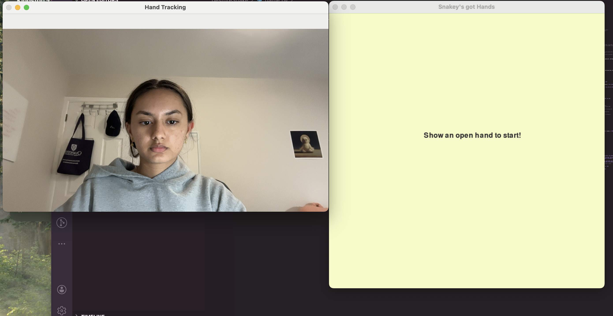
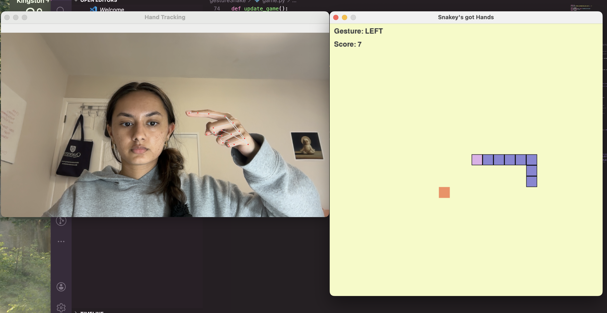
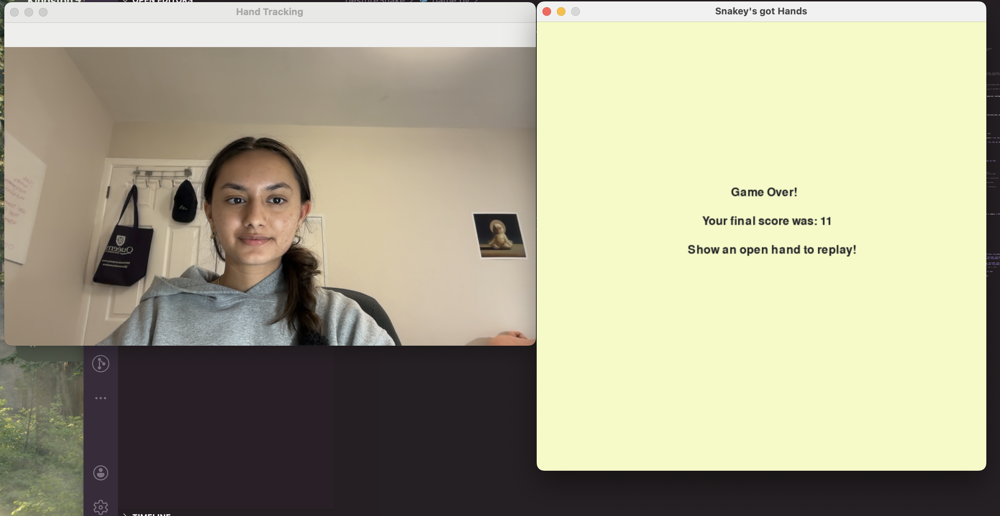

# Gesture Controlled Snake Game
This is a project that I completed in order to introduce myself to computer vision. It's a snake game that is controlled entirely through hand gestures using OpenCV and MediaPipe's hand landmark detection.
You don't need a keyboard, just start the game with an open-hand gesture and move the snake by pointing your index finger.

## Tech Stack
- Python 3
- MediaPipe
- OpenCV
- Pygame

## Installation
Clone the repository:
``` ruby
git clone https://github.com/NavyaBajwa/GestureSnakeGame.git
cd GestureSnakeGame
```
Install dependencies:
``` ruby
pip install opencv-python mediapipe pygame
```
## Demo
### 1) Start Screen


### 2) Starting Game


### 3) Playing Game


### 4) Game Over


